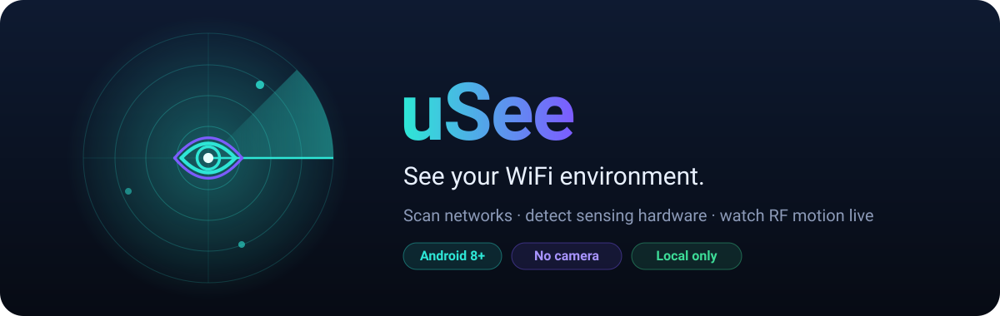

<p align="center">
  
</p>

<p align="center">
  <a href="https://github.com/2B-4G10/uSee/releases/latest"><b>⬇️ Download the latest APK</b></a>
  &nbsp;·&nbsp; <a href="#-get-started-in-2-minutes">Get started</a>
  &nbsp;·&nbsp; <a href="#-faq">FAQ</a>
</p>

---

**uSee** turns your Android phone into a WiFi radar. It maps every network around you, works out which sensing hardware you have, and shows movement in the room as a live picture. There's no camera, account or cloud. Everything stays on your own network.

<table>
  <tr>
    <td align="center" width="25%"><br><sub><b>Sense</b> · phone WiFi</sub></td>
    <td align="center" width="25%"><br><sub><b>Sense</b> · ESP32 sensor</sub></td>
    <td align="center" width="25%"><br><sub><b>Scan</b></sub></td>
    <td align="center" width="25%"><br><sub><b>Detect</b></sub></td>
  </tr>
</table>
<p align="center"><sub>Screenshots use sample (synthetic) data.</sub></p>

## ✨ What you can do

| | |
|---|---|
| 📡 **Sense** | Watch a live radar that reacts when someone moves through the WiFi field. You also get a motion score, a 60-second history and, with a sensor that provides them, breathing and heart-rate estimates. |
| 📶 **Scan** | See every nearby network: name, signal, channel, band (2.4 / 5 / 6 GHz), WiFi generation, security and a rough distance. A spectrum chart shows which channels are crowded. |
| 🛰️ **Detect** | uSee finds the best sensing tool by itself: a RuView server, an ESP32 sensor or your phone's own WiFi. It also lists what your phone's WiFi chip supports. |
| ⚙️ **Settings** | Pick a sensor yourself, change how often it scans, or connect to a server by address. |

## 🚀 Get started in 2 minutes

1. **Download** `uSee-<version>.apk` from the [latest release](https://github.com/2B-4G10/uSee/releases/latest) on your phone.
2. **Open the file.** If Android asks, allow your browser or file manager to *install unknown apps*.
3. **Launch uSee** and tap **Grant access**. Android requires Location permission before any app can read WiFi scan results. uSee does not record where you are.
4. Make sure **WiFi** and **Location services** are on. uSee shows a banner if either one is off.
5. Open **Sense**, keep still for about 5 seconds while it learns the room, then walk around and watch the radar react.

> **Updating:** install a newer APK over the old one. If Android says the app *conflicts with an existing package*, the new build has a different signature. Uninstall uSee first, then install the new APK.

## 🧭 Which sensor is it using?

uSee always picks the best source that is sending data right now. The chip at the top right of the app shows which one:

| Chip | Source | What it can tell you |
|:---:|---|---|
| 🟣 **Server** | A RuView sensing server on your network | Presence, motion and vitals from the full RuView system |
| 🟢 **CSI** | An ESP32 RuView sensor streaming to your phone | Detailed signal data per WiFi subcarrier, a live heat-map, and vitals from the sensor |
| 🔵 **RSSI only** | Just your phone | Movement that disturbs the WiFi signal near you |

<details>
<summary><b>Connect an ESP32 sensor</b></summary>

<br>

Set up the sensor so it sends its data to your phone. Your phone's IP address is shown on the **Detect** tab:

```bash
python firmware/esp32-csi-node/provision.py --port <serial-port> --target-ip <phone-ip> --target-port 5005
```

Within a few seconds the chip switches to **CSI** and the heat-map appears on **Sense**.
</details>

<details>
<summary><b>Connect a RuView sensing server</b></summary>

<br>

On the same WiFi network, uSee finds the server automatically. The server only accepts addresses it knows, so start it with the address your phone will use:

```bash
sensing-server --allowed-host <server-ip>
```

If the server requires a token, paste it into **Settings → RuView sensing server**. You can also type the server's address there or on the **Detect** tab.
</details>

## 🔒 Privacy

- 🚫 **No camera, no microphone, no account.**
- 🏠 **Local only.** uSee only talks to devices on your private home or office network. It sends nothing to the internet.
- 👀 **Read-only.** When it searches your network for sensors it only *reads* status pages. It never changes another device.
- 💤 **Off when hidden.** Scanning stops as soon as you leave the app.
- 🔑 Any server token you enter stays on your phone and is left out of backups.

## ❓ FAQ

<details>
<summary><b>Can uSee see people through walls like a camera?</b></summary>

<br>

No. WiFi sensing is not camera-grade. With only your phone, uSee can notice that **something is moving** because movement disturbs the WiFi signal. It cannot see a person who is perfectly still, count people or show their shape. An ESP32 sensor or a RuView server gives much richer data, but the results are still estimates.
</details>

<details>
<summary><b>Why does the Scan list update slowly?</b></summary>

<br>

Android lets an app scan for networks only **4 times every 2 minutes**. Between scans, uSee watches the signal of the network you're connected to several times a second. To remove the limit, go to *Settings → Developer options → WiFi scan throttling* and turn it off.
</details>

<details>
<summary><b>The radar says "Calibrating" or reacts to nothing.</b></summary>

<br>

Tap **Recalibrate**, leave the room or stay still for a few seconds, and let uSee learn the quiet signal level again. The motion levels are tuned estimates, not certified measurements. Results depend on your router, the walls and the distance.
</details>

<details>
<summary><b>Are the breathing and heart-rate numbers medical?</b></summary>

<br>

No. They are experimental estimates from the sensor and are only shown when a sensor provides them. Never use them for health decisions.
</details>

<details>
<summary><b>How accurate is the distance on the Scan tab?</b></summary>

<br>

It's a rough guide. It ignores walls and antennas, so treat it as "near or far", not as an exact number of metres.
</details>

## 📋 Requirements

- Android **8.0 (Oreo)** or newer, with WiFi
- **Location** permission, plus **Nearby WiFi devices** on Android 13+
- Optional: a RuView ESP32 sensor or a RuView sensing server for richer sensing

---

<p align="center">
  <sub>Made by <b>Faisal AlDossary</b> · Built on <a href="../README.md">RuView</a> (MIT License)</sub><br>
  <sub>Developers: <a href="docs/DEVELOPING.md">build &amp; architecture</a> · <a href="docs/MAINTAINING.md">updates, releases &amp; repository lock</a></sub>
</p>
