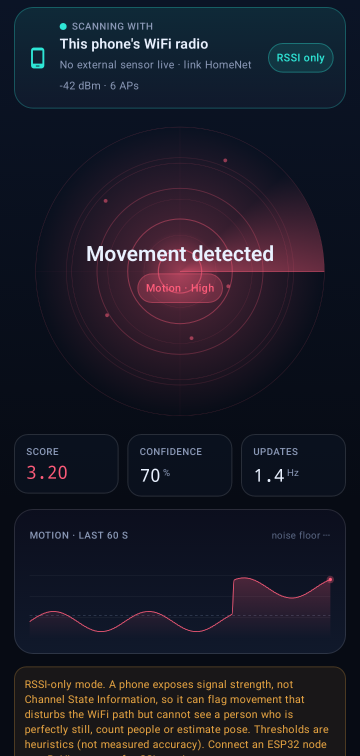
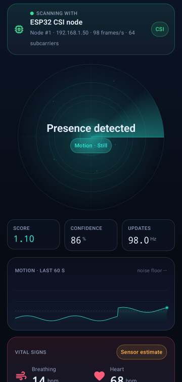
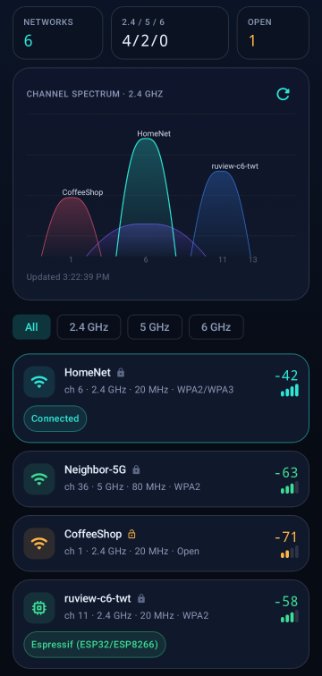
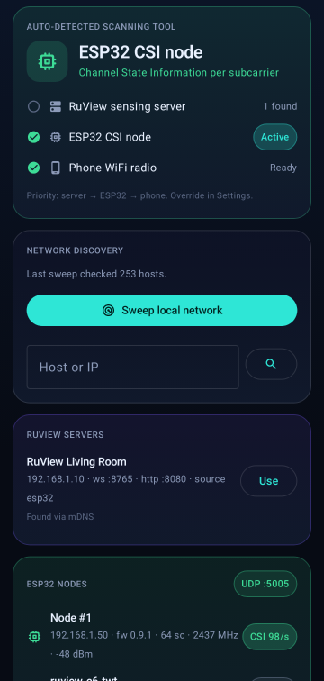

# uSee — WiFi environment scanner for Android

uSee is a native Android app (Kotlin + Jetpack Compose) that scans the WiFi
environment around the phone, **auto-detects which sensing hardware is
available**, and turns RF disturbances into a live motion view. It is the
mobile front end for the RuView sensing stack in this repository.

| Sense (phone RSSI) | Sense (ESP32 CSI) | Scan | Detect |
|---|---|---|---|
|  |  |  |  |

> Screenshots are JVM renders of the real screens fed with **SYNTHETIC** data;
> they do not show a measurement.

## What it does

| Tab | Purpose |
|---|---|
| **Sense** | Animated radar, motion level, confidence, 60 s motion history, vitals (when the source provides them) and a live CSI amplitude waterfall for ESP32 nodes. |
| **Scan** | Every visible access point: SSID, BSSID, RSSI, channel, band, width, Wi-Fi generation, security, free-space distance estimate and hardware hints, plus a channel-spectrum chart for 2.4 / 5 / 6 GHz. |
| **Detect** | Auto-detection of the scanning tool and an inventory of what was found: this phone's radio capabilities, RuView sensing servers and ESP32 nodes. |
| **Settings** | Source override, scan interval, UDP port, server address/token. |

### Auto-detection of the scanning tool

uSee looks for three kinds of sensor and uses the best one that is **live**
(delivered data in the last 5 s):

1. **RuView sensing server** — found by mDNS (`_ruview._tcp`), by a read-only
   sweep of `GET :8765/health` and `:8080/health` on the phone's private
   subnet, or by manual entry. Streams `ws://<host>:8765/ws/sensing`.
2. **ESP32 CSI node** — found when it streams RuView UDP frames
   (`0xC5110001` CSI, `0xC5110002` vitals, `0xC5110004` fused vitals) to the
   phone, by its read-only `GET :8032/ota/status` page, or as a hint when an
   Espressif MAC prefix / `ruview-*` SSID shows up in the scan.
3. **This phone's WiFi radio** — always available. The Detect tab reports the
   radio's bands (2.4/5/6/60 GHz), supported Wi-Fi generations, 802.11mc RTT,
   WiFi Aware/Direct, OS scan throttling and the current link.

The choice can be pinned in Settings (Auto / Phone / ESP32 / Server).

### What each tier can and cannot do

| Source | Signal | Can | Cannot |
|---|---|---|---|
| Phone | RSSI per AP | Flag movement that disturbs the WiFi path | See a still person, count people, estimate pose or vitals |
| ESP32 | CSI per subcarrier | Finer motion score (computed in the app), edge vitals from the node | Be treated as a medical device |
| Server | RuView pipeline | Whatever the server reports (presence, motion, vitals) | — values are shown as received |

WiFi sensing is probabilistic and **not camera-grade**. The motion thresholds
in `core/MotionEstimator.kt` are heuristics (CLAIMED behaviour, not a measured
accuracy); no accuracy figure is asserted by this app.

Android only exposes RSSI to apps; stock phones cannot capture CSI. Android
also limits foreground apps to 4 WiFi scans per 2 minutes, so the phone tier
mostly samples the connected link's RSSI (~3 Hz) and uses multi-AP scans
whenever the OS delivers them. Turning off *Developer options → WiFi scan
throttling* lifts the limit.

## Install

Grab `usee-apk` from the **Android APK** workflow run (or build it below) and
sideload it: enable *Install unknown apps* for your file manager, open
`app-release.apk`. Requires Android 8.0 (API 26) or newer.

Permissions: **Location** (Android requires it to return scan results) and
**Nearby WiFi devices** (Android 13+). Location services must be on for scan
results. uSee never records position.

## Connecting sensors

**ESP32 node → phone.** Point the node's UDP target at the phone (its IP is
shown on the Detect tab):

```bash
python firmware/esp32-csi-node/provision.py --port <serial> \
  --target-ip <phone-ip> --target-port 5005
```

**Sensing server.** On the same LAN the app discovers the server by mDNS. The
server's DNS-rebinding guard rejects unknown `Host` headers, so start it with
the address the phone will use (the app shows this hint when it is rejected):

```bash
sensing-server --allowed-host <server-lan-ip> ...
```

If the server has `RUVIEW_API_TOKEN` set, paste the token in Settings; it is
sent as `Authorization: Bearer …` and kept in app-private storage, excluded
from backups.

## Build

Requirements: JDK 17+, Android SDK (platform 35, build-tools 35).

```bash
cd android
./gradlew testDebugUnitTest      # JVM unit tests
./gradlew lintRelease
./gradlew assembleRelease        # app/build/outputs/apk/release/app-release.apk
```

Release signing reads `android/keystore.properties` (`storeFile`,
`storePassword`, `keyAlias`, `keyPassword`) or the `USEE_KEYSTORE_FILE`,
`USEE_KEYSTORE_PASSWORD`, `USEE_KEY_ALIAS`, `USEE_KEY_PASSWORD` environment
variables. Without them the release APK is signed with the debug key — fine
for sideloading, not for a store upload. Keystores are git-ignored.

## Layout

```
app/src/main/java/com/usee/scanner/
  core/        pure Kotlin: packet decoders, motion estimator, WiFi math, OUI hints, IPv4 helpers
  data/        Android adapters: WifiManager scanner, LAN discovery (mDNS + probes),
               UDP CSI receiver, sensing-server WebSocket client, settings
  ui/          AppViewModel (source arbitration), theme, components, screens
app/src/test/  unit tests for decoders, estimator, WiFi math, server frame parsing
```

## Security and privacy

- Network discovery is read-only (`GET` only) and restricted to RFC 1918
  subnets; larger subnets are narrowed to the phone's /24.
- UDP input is validated against the RuView magics and the datagram length
  before any field is used.
- Radios run only while the app is in the foreground.
- No analytics, no cloud calls; cleartext is allowed only because LAN
  sensors speak plain HTTP/WebSocket.

Author: Faisal AlDossary. Built on RuView (MIT License).
